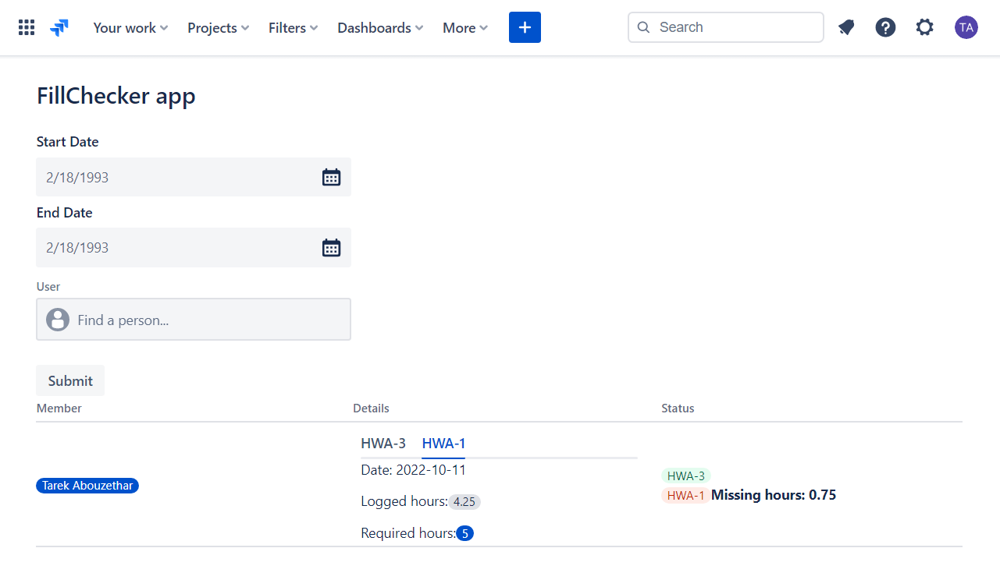

# Forge FillChecker app

This project contains a Forge app written in Javascript that checks Team members work log hours in a Jira global page. The app queries Rest API for work logs.  

## Features
- Select start and end date
- Select User name 
- Display work log hour according to the filters
- Display the results in a table
- Display User name corresponding to account id
- Display issue created date, logged hours and required hours
- Display issue status and compare it with required hours(Red for missing/ Green for meeting the required hours)

## Project directory overview
* manifest.yml - A Forge app manifest that defines two modules:
    - A confluence:globalPage module.
    - A corresponding function module that implements the issue panel logic.
* src/
    - index.jsx - app,s entry point
    - components/ - UI components

## Forge features used
* UI components
    - GlobalPage
    - Form
    - Table

* UI hooks
        - useState

